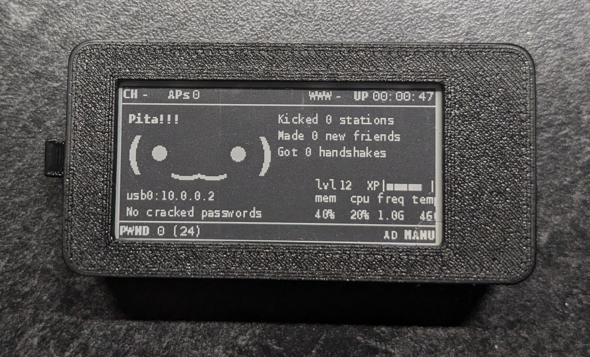
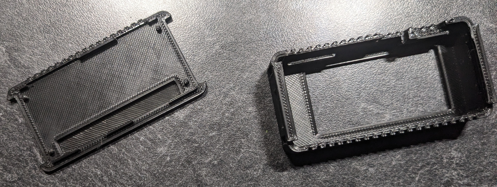

# Pwnagotchi Project-Writeup
**This is NOT a Pwnagotchi guide.**

This is my personal documentation for building and running my own Pwnagotchi, the hardware I used, how I set it up, which plugins I added, and what I learned along the way.

First, I recomend learning how handshakes in the WPA/WPA2 protocol work, which I explain [here](WifiHandshakes.md).

---

## :warning: Disclaimer :warning:
This project is intended for **educational purposes only**.

Do not use your Pwnagotchi—or any similar tools—on networks you do not own or have explicit permission to test. Unauthorized interception of wireless communications may be illegal and unethical.

I do not condone or support any malicious activity using the tools or techniques mentioned in this documentation.

---

## Hardware
- **Raspberry Pi Model**: Raspberry Pi Zero 2
- **Display**: Waveshare_v4 2.13inch E-Ink Display
- **Case**: PicoProject 3d Printed Case

---
# Steps
## Windows driver
# Imaging
# ?
# 3d Printed case

---

## Plugins Installed
- Plugin 1: IPDisplay
- Plugin 2: better_quickdic
- Plugin 3: display-password
- Plugin 4: enable_assoc
- Plugin 5: enable_deauth
- Plugin 6: exp
- Plugin 7: handshakes-dl
- Plugin 8: instattack
- Plugin 9: internet-connection
- Plugin 10: memtemp-plus
- Plugin 11: tweak_view
- Plugin 12: wpa-sec-list

---

## Issues/Fixes
##### BT-Tethering
Only issue I encounted was getting bluetooth to proplerly pair to my phone. After scouring threads and forums I accidently came across the fix.

The original image I used (jayofelony) had limited bluetooth settings, and I noticed that other people's config had more options listed, though these people were still reporting issues. I simply added the options to my config, filled them out and *voila*.

Make sure to have the following in your config.toml - ios or android respectively

>main.plugins.bt-tether.enabled = true
>main.plugins.bt-tether.devices.android-phone.enabled = true
>main.plugins.bt-tether.devices.android-phone.search_order = 1
>main.plugins.bt-tether.devices.android-phone.mac = ""
>main.plugins.bt-tether.devices.android-phone.ip = "192.168.44.44"
>main.plugins.bt-tether.devices.android-phone.netmask = 24
>main.plugins.bt-tether.devices.android-phone.interval = 1
>main.plugins.bt-tether.devices.android-phone.scantime = 15
>main.plugins.bt-tether.devices.android-phone.max_tries = 6
>main.plugins.bt-tether.devices.android-phone.share_internet = true
>main.plugins.bt-tether.devices.android-phone.priority = 1

>main.plugins.bt-tether.devices.ios-phone.enabled = false
>main.plugins.bt-tether.devices.ios-phone.search_order = 2
>main.plugins.bt-tether.devices.ios-phone.mac = ""
>main.plugins.bt-tether.devices.ios-phone.ip = "175.20.10.6"
>main.plugins.bt-tether.devices.ios-phone.netmask = 24
>main.plugins.bt-tether.devices.ios-phone.interval = 5
>main.plugins.bt-tether.devices.ios-phone.scantime = 20
>main.plugins.bt-tether.devices.ios-phone.max_tries = 0
>main.plugins.bt-tether.devices.ios-phone.share_internet = false
>main.plugins.bt-tether.devices.ios-phone.priority = 999

---
